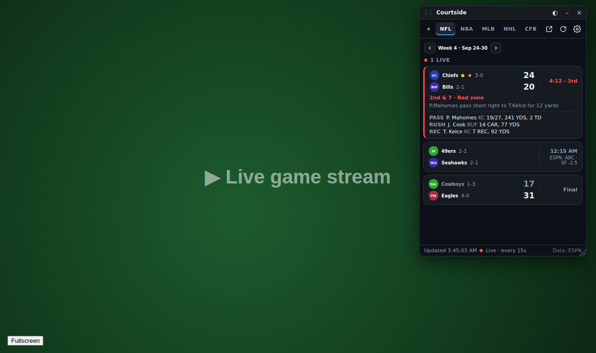
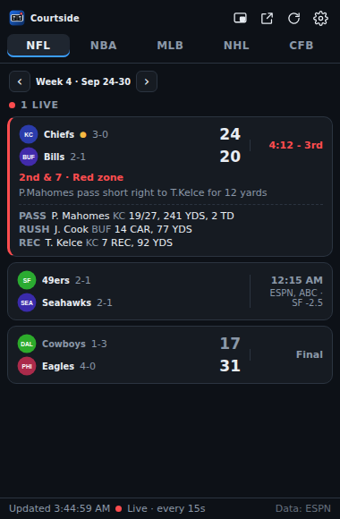
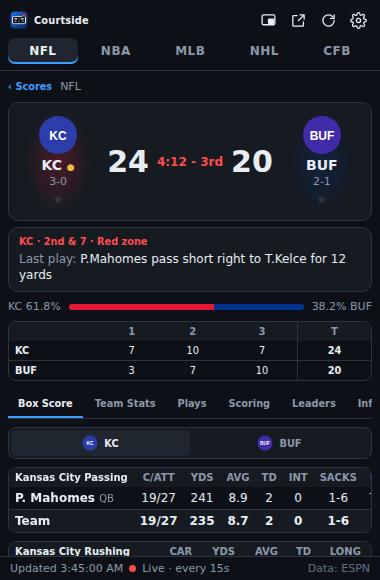
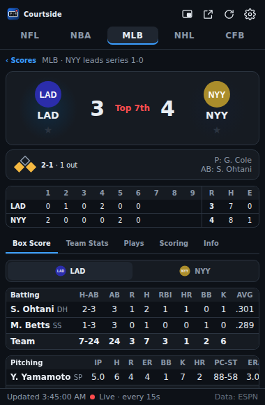
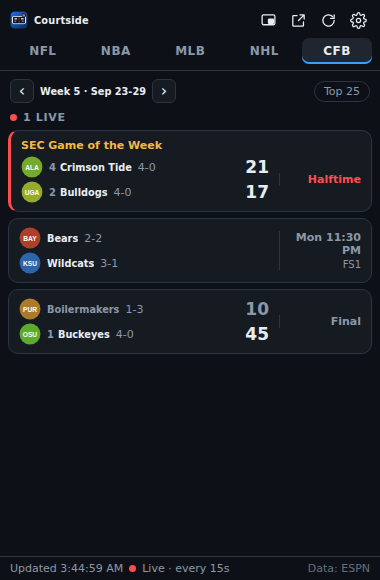
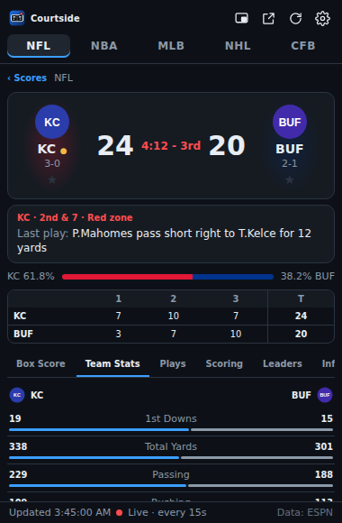
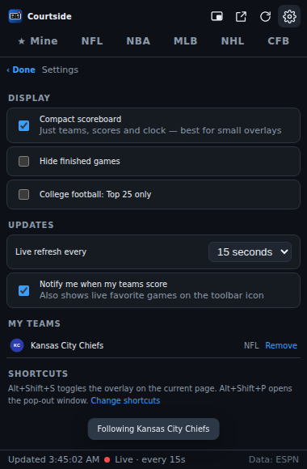

# Courtside: live scores overlay for Chrome

Courtside is a Chrome extension that shows live scores, box scores and player stats for the **NFL, NBA, MLB, NHL and college football (FBS)**. You can float it over the game you're watching.

<p>
  
</p>

## Three ways to view it

| | How to open | Best for |
|---|---|---|
| **Popup** | Click the toolbar icon | A quick check of scores |
| **Overlay** | Overlay button in the popup, or **Alt+Shift+S** | Floating over a stream in the same tab. You can drag it, resize it, make it see-through or minimize it, and it stays visible when the player goes fullscreen. |
| **Pop-out window** | Pop-out button, or **Alt+Shift+P** | A separate small window. Click the 📌 button to keep it **on top of every window**, including a TV app or another browser. This uses Chrome's Document Picture-in-Picture. |

Your place (league, open game, tab) carries over between all three views.

## What it shows

**Scoreboard** (each league has its own tab)
- Live games first, then upcoming, then final. Favorite teams are pinned to the top.
- Score, clock and period, records, and rankings (CFB).
- Football: down and distance, a possession marker, and a red-zone flag.
- Baseball: base runners on a diamond, balls-strikes and outs, and the current batter. Probable pitchers show before the game.
- Game leaders (passing, rushing and receiving; points; and so on), plus the last play.
- TV network, betting line, playoff series status and game notes (for example "SEC Game of the Week").
- Browse by week for football (including preseason and postseason) and by day for the NBA, MLB and NHL. College football can be filtered to the **Top 25**.

**Game detail** (click any game)
- A scorebug with team colors, a live situation panel and a win-probability bar.
- A linescore by quarter, period or inning, with R/H/E for baseball.
- **Box score** for each team: every stat group ESPN provides. That covers passing, rushing, receiving, defense and kicking for football; starters and bench, including DNP reasons, for the NBA; batting and pitching for MLB; forwards, defense and goalies for the NHL.
- **Team stats** side by side with comparison bars.
- **Plays**: the latest plays, with scoring plays highlighted.
- **Scoring summary**, grouped by period.
- **Leaders**, with headshots.
- **Info**: venue, TV, attendance, line and series.

**My teams**
- Tap ★ next to a team in any game to follow it. A **★ Mine** tab then collects today's games for all your teams across leagues.
- The toolbar badge shows **LIVE** while one of your teams is playing.
- Optional desktop alerts when your team's game starts, when either team scores, and at the final whistle. Clicking an alert opens that game.

**Settings**: compact scoreboard, hide finished games, refresh rate for live games (10 to 60 seconds), and alerts on or off.

Live games refresh automatically (every 15 seconds by default). Updates slow down when nothing is live and pause while the view is hidden.

## Install (developer mode)

1. Download or clone this repository.
2. Open `chrome://extensions` and turn on **Developer mode** (top right).
3. Click **Load unpacked** and select this folder (the one that contains `manifest.json`).
4. Pin **Courtside** to the toolbar from the puzzle-piece menu.

It needs Chrome 116 or newer. To change the keyboard shortcuts, go to `chrome://extensions/shortcuts`.

To build a zip for the Chrome Web Store, run `npm run package`. The zip is written to `dist/`.

## Using the overlay

- **Move**: drag the title bar. **Resize**: drag the bottom-right corner. Position and size are remembered.
- **◐** steps through transparency levels (90% down to 45%). The overlay becomes fully opaque when your mouse is over it.
- **–**, or double-clicking the title bar, collapses it to a thin bar.
- **×**, or Alt+Shift+S again, closes it.
- **Fullscreen**: when a site makes its player container fullscreen (YouTube, most streaming sites), the overlay moves inside it and stays visible. Some sites make the `<video>` element itself fullscreen, and nothing can be drawn over that. On those sites, use the pop-out window with 📌 **Keep on top** instead.
- Chrome blocks extensions on its own pages (`chrome://…`, the Web Store). On those pages, the shortcut opens the pop-out window instead.

## Permissions

| Permission | Why |
|---|---|
| `activeTab`, `scripting` | Add the overlay to the tab you're on, only when you ask. There is no access to any site until you click or press the shortcut. |
| `https://site.api.espn.com/*` | Fetch scores and stats |
| `storage` | Settings, favorites, overlay position |
| `alarms`, `notifications` | Watch your favorite teams in the background and send score alerts |

There is no tracking and no account. All data goes straight from your browser to ESPN.

## Data source

Scores and stats come from ESPN's public site API (`site.api.espn.com/apis/site/v2/sports/...`). It is free and needs no key, but it is **unofficial and undocumented**, so ESPN could change or rate-limit it. All ESPN-specific parsing is in [`src/lib/espn.js`](src/lib/espn.js), which turns each response into a small, stable format. If ESPN changes something, that file is the only one to update.

## Project layout

```
manifest.json            Manifest V3
src/background.js        Service worker: overlay injection, pop-out window, favorite-team alerts and badge
src/content/overlay.js   Injected on demand; draggable, resizable shadow-DOM frame around the app
src/app/app.html|css|js  The UI; one page runs as popup, overlay (?mode=overlay) or window (?mode=window)
src/app/tick-worker.js   Refresh timer that isn't throttled when the window is hidden
src/lib/espn.js          ESPN response → normalized games/box scores (pure functions)
src/lib/api.js           Fetching with timeouts
src/lib/leagues.js       League definitions and period labels
src/lib/storage.js       Settings, favorites, UI state
tests/                   Unit tests, ESPN-shaped fixtures, Playwright end-to-end run
```

There is no build step: plain ES modules that Chrome loads directly.

## Tests

```sh
npm test            # unit tests for the ESPN normalizers (Node 20+)
npm run test:e2e    # loads the extension in Chromium with Playwright, using fixture data
```

The end-to-end run fills in for ESPN with the fixtures in `tests/fixtures/espn.js`. It then exercises every league, game detail tabs, favorites and the badge, settings, error recovery, the overlay (drag, resize, transparency, minimize, fullscreen, toggle) and the pop-out window. Screenshots are saved to `tests/e2e/screenshots/`.

## Screenshots

| Scoreboard | Game detail | Baseball |
|---|---|---|
|  |  |  |
| **College football** | **Team stats** | **Settings** |
|  |  |  |

The team logos in these screenshots are placeholders from the test fixtures. The real extension shows each team's actual logo from ESPN.
